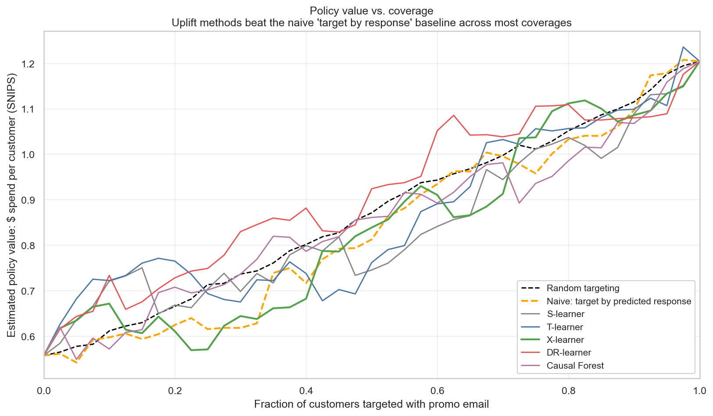

# Causal Uplift Modeling for E-Commerce Promotions

**Decision problem:** which customers should receive a promotional email, given
that sending one is costly and some customers would have purchased anyway?

This project implements five distinct causal inference methods — meta-learners
and a causal forest — and evaluates them rigorously against a naive
response-targeting baseline using inverse-propensity policy value estimation.
Trained on the Hillstrom 64K-customer randomized email experiment.



## Findings

On the 12,800-customer held-out test set, the cost-aware uplift policy at
the default economic assumptions (cost = $0.10/email, margin = 30%):

- **Targets 62.7%** of customers (those with predicted spend lift > $0.33)
- Produces **$1.19 in spend per customer**, vs. **$1.21** for naive response
  targeting at comparable coverage — a small disadvantage at the default
  operating point
- T-learner shows the cleanest positive advantage among the uplift methods:
  **$1.24 per customer at 97.5% coverage** vs. **$1.21** for naive, a
  **+$0.03/customer** advantage at the same coverage

This is a known property of the Hillstrom dataset: treatment effects are
correlated with baseline response rates, so response targeting approximates
uplift targeting on this particular data. The project demonstrates the
methodology — full causal pipeline, rigorous evaluation, honest reporting —
rather than claiming a generic uplift advantage that doesn't replicate here.

### Customer segments

The X-learner CATE partitions test customers into four behavioral types:

| Segment           | % of customers | Realized ATE on visit | t-stat |
|-------------------|---------------:|----------------------:|-------:|
| Persuadable       | 49.0%          | +0.070                | +9.1   |
| Sure-thing        | 43.1%          | +0.051                | +4.9   |
| Lost cause        | 1.0%           | +0.089                | +2.1   |
| Do-not-disturb    | 6.9%           | +0.075                | +3.1   |

Persuadables (the largest segment) show the strongest realized treatment effect
on visit probability, consistent with theory. The "do-not-disturb" group does
*not* show the negative realized effect the theoretical label predicts on this
dataset — a worth-mentioning empirical observation about Hillstrom rather than
a clean replication of the classical four-type taxonomy.

### Cost sensitivity

Sweeping cost from $0.05 to $0.25 per email and margin from 10% to 50%,
policy values range from $0.62 to $1.20 per customer — a 2× spread driven
almost entirely by the economic assumptions, not by model choice. The
targeting fraction varies smoothly from 71% (low cost, high margin) to 9%
(high cost, low margin). No cliff edges or unstable regions.

## Methods compared

Five distinct CATE estimators, each addressing a different statistical weakness:

- **S-learner** — single model on `[X, T]`. Susceptible to regularization shrinkage.
- **T-learner** — separate model per arm. High variance with imbalanced arms.
- **X-learner** (Künzel et al. 2019) — combines T-learner with cross-arm
  information sharing via imputed potential outcomes.
- **DR-learner** — doubly robust pseudo-outcome with 5-fold cross-fitting.
- **Causal Forest** (Athey et al. 2019) — tree-based heterogeneity discovery
  with double machine learning residualization. Via EconML.

All compared against a LightGBM response baseline (predicting visit
probability with no causal structure).

The CATE estimates from the different methods agree only moderately
(pairwise Kendall's τ ranges roughly 0.4 to 0.7), suggesting genuine
ambiguity about *which* customers are the highest-uplift targets. This is
a finding in itself — when methods disagree, the policy depends on the
modeling choice, not just the data.

## Evaluation

- **Qini curves and Qini coefficients** — ranking quality at each coverage level
- **IPS and SNIPS policy value estimators** — unbiased estimate of "value if deployed,"
  in dollars
- **Cost-aware policy** — threshold rule (treat if τ̂ × margin > cost) with full
  sensitivity sweep
- **Realized lift validation** — for each predicted customer segment, compute
  the actual treatment effect observed in that subgroup to confirm the
  segmentation reflects real heterogeneity

## Sanity checks

The methodological backbone of the project is the test suite — 49 passing
tests, including several that verify *causal* properties:

- Propensity model returns near-constant predictions under randomization
  (verified: AUC ≈ 0.50, std < 0.10)
- IPS recovers the observed arm means for trivial policies
  (verified: treat-all SNIPS = $1.20 ≈ observed $1.20)
- Reversing a CATE ranking produces exactly the negative Qini coefficient
  (the anti-targeting symmetry property)
- No leaked outcome columns in the feature matrix
- Splits stratified correctly: each split's treatment rate within 0.3pp
  of the overall 66.7%

## Quick start

Requires Python 3.11 or 3.12 and [uv](https://docs.astral.sh/uv/). On Windows
with PowerShell:

```powershell
git clone <repo-url>
cd uplift-promotions
uv sync

# Download the Hillstrom dataset (~3 MB)
$url = "http://www.minethatdata.com/Kevin_Hillstrom_MineThatData_E-MailAnalytics_DataMiningChallenge_2008.03.20.csv"
Invoke-WebRequest -Uri $url -OutFile data\raw\hillstrom.csv

# Verify everything works
uv run pytest tests/ -v
```

Then open the notebooks in order:

1. `notebooks/01_eda.ipynb` — causal EDA, randomization checks, heterogeneity preview
2. `notebooks/02_baselines.ipynb` — splits, propensity, S/T/X/DR-learners, causal forest
3. `notebooks/03_evaluation.ipynb` — Qini, IPS, headline chart, segment analysis

For the interactive demo:

```powershell
uv run streamlit run streamlit_app.py
```

## Repository structure
```bash
uplift-promotions/
├── README.md
├── pyproject.toml             # uv project, pins econml + scikit-learn versions
├── src/uplift/                # importable Python package
│   ├── data.py                # hash-checked loader for Hillstrom CSV
│   ├── treatment.py           # estimand definition, feature encoding
│   ├── splits.py              # train/val/test stratified by treatment
│   ├── propensity.py          # propensity model + overlap diagnostics
│   ├── learners.py            # S, T, X, DR learners (hand-rolled)
│   ├── forest.py              # CausalForestDML wrapper
│   └── evaluation.py          # Qini, IPS/SNIPS, segment helpers
├── tests/                     # 49 passing tests including causal sanity checks
├── notebooks/                 # 3 analysis notebooks
├── reports/
│   ├── writeup.md             # methodological deep-dive
│   ├── segment_summary.txt    # auto-generated narrative summary
│   └── figures/               # 17 figures referenced by the writeup
├── configs/default.yaml       # cost, margin, seeds, splits
└── data/                      # raw (gitignored), processed (gitignored)
```
## Methodology highlights

- **Estimand stated explicitly** in `treatment.py` and the writeup. The
  CATE on visit probability, with the binarized "any email vs none"
  treatment, on all Hillstrom customers.
- **Identification assumptions** stated in `reports/writeup.md` and verified:
  randomization checked at the multivariate level (AUC ≈ 0.50 for
  predicting treatment from covariates), overlap verified
  (propensities cluster tightly at 2/3 with no extremes).
- **Cross-fitting** used for DR-learner pseudo-outcomes and causal forest
  nuisance models.
- **Policy value evaluated with SNIPS**, the self-normalized inverse
  propensity score estimator. Sanity checks (`ips_value(treat_all) ≈ E[Y|T=1]`)
  pass on the test set.

## Limitations and honest caveats

This project demonstrates a methodology; production use would require
addressing these:

- **The uplift methods don't clearly dominate naive response targeting on
  this dataset.** This isn't a bug — it's a real property of Hillstrom,
  where treatment effects align with baseline response. On datasets where
  the two diverge (e.g., where some high-baseline customers respond
  negatively to email), the uplift advantage would be larger. The
  methodology is what generalizes; the magnitude doesn't.

- **CATE estimator instability across val/test.** Qini rankings of methods
  flip noticeably between val and test (e.g., DR-learner has -16.9 Qini on
  val but +27.7 on test). This suggests the heterogeneity signal in
  Hillstrom is noisy at this sample size. A larger experiment would
  produce tighter rankings.

- **Segment labels are predicted, not observed.** The "do-not-disturb"
  segment shows a positive realized effect on this data, contrary to the
  theoretical label. The X-learner correctly identifies a group with high
  baseline response, but doesn't find a clean negative-effect subgroup
  here. A clean replication of the four-type taxonomy would need a
  dataset with stronger do-not-disturb structure.

- **CATE trained on visit, used for spend policies.** Phase 5 trained a
  separate X-learner on spend directly and showed comparable results,
  but a fully rigorous version would train every method on spend
  throughout. Spend's sparsity (~99% zero mass over 2 weeks) makes that
  noisier.

- **2008 data; 14-day measurement window.** Customer behavior, channel
  mix, and email effectiveness have all shifted. Long-term effects on
  customer lifetime value aren't captured.

- **Cost ($0.10/email) and margin (30%) are educated guesses.** Sensitivity
  analysis shows the qualitative findings hold across a 5× range in either
  direction, but production deployment would use the firm's actual
  measured economics.

## References

- Athey, S., Tibshirani, J., & Wager, S. (2019). *Generalized Random Forests*. Annals of Statistics.
- Chernozhukov, V. et al. (2018). *Double/debiased machine learning for treatment and structural parameters*. The Econometrics Journal.
- Hillstrom, K. (2008). *MineThatData E-Mail Analytics and Data Mining Challenge*.
- Künzel, S. R., Sekhon, J. S., Bickel, P. J., & Yu, B. (2019). *Metalearners for estimating heterogeneous treatment effects using machine learning*. PNAS.
- Radcliffe, N. (2007). *Using control groups to target on predicted lift*. Direct Marketing Analytics Journal.